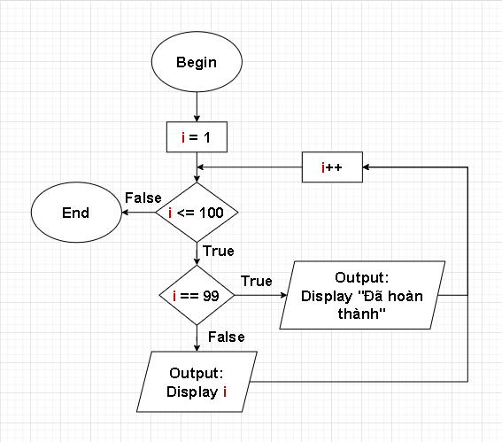
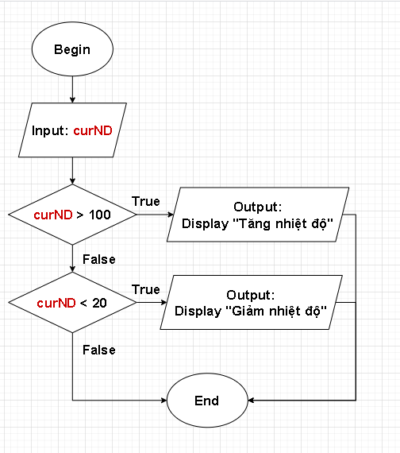
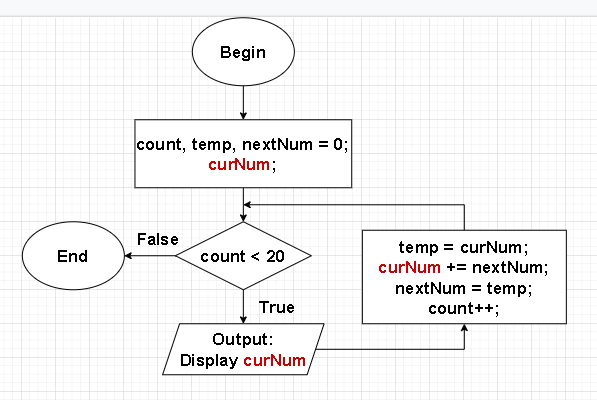
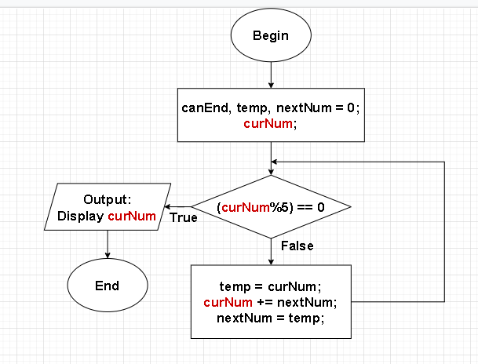
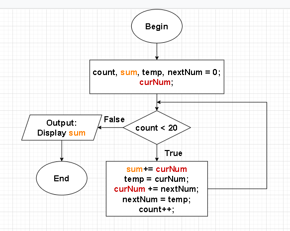
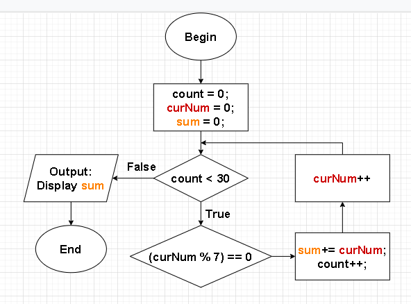
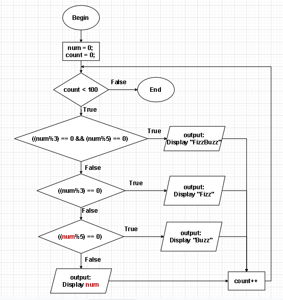
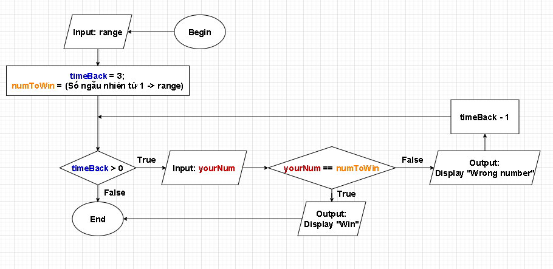

### [*Bài tập] Luyện tập vòng lặp 01

- Bài 1: Sử dụng vòng lặp để đếm từ 1 đến 100. Khi số là 99, hiển thị hộp thoại thông báo là đã hoàn thành.

- Bài 2: Sử dụng hàm prompt() để lấy thông tin nhiệt độ hiện tại được nhập bởi người truy cập. Nếu nhiệt độ nhập vào trên 100, yêu cầu người dùng giảm nhiệt độ. Nếu nhiệt độ dưới 20, yêu cầu người dùng tăng nhiệt độ.

- Bài 3: Hiển thị ra 20 số trong dãy fibonacci đầu tiên.

- Bài 4: Tìm số đầu tiên trong dãy fibonacci chia hết cho 5.

- Bài 5: Tính tổng của 20 số đầu tiên trong dãy fibonacci.

- Bài 6: Tính tổng của 30 số chia hết cho 7 đầu tiên trong các số tự nhiên.

- Bài 7: Hãy viết một chương trình in ra các số từ 1 đến 100. Nhưng nếu số chia hết cho 3 thì in ra "Fizz", 5 thì in ra "Buzz" thay vì in ra số đó. Và nếu số đó chia hết cho cả 3 và 5 thì in ra chữ "FizzBuzz".

- Bài 8: Game đoán số

